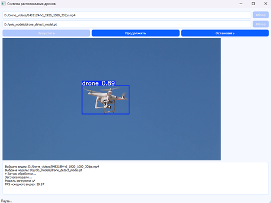

# Object Detection Application

Проект представляет собой приложение для обнаружения объектов на видео с использованием модели YOLO.

## Требования

- Python версии 3.13 или выше
- Операционная система: Windows, macOS или Linux

## Установка и запуск

### Создание виртуальной среды
```
python3 -m venv venv
```
### Активация виртуальной среды
```
source venv/bin/activate
```
### Установка зависимостей
```
pip install -r requirements.txt
```
## Далее можно запускать файл
- main.py

